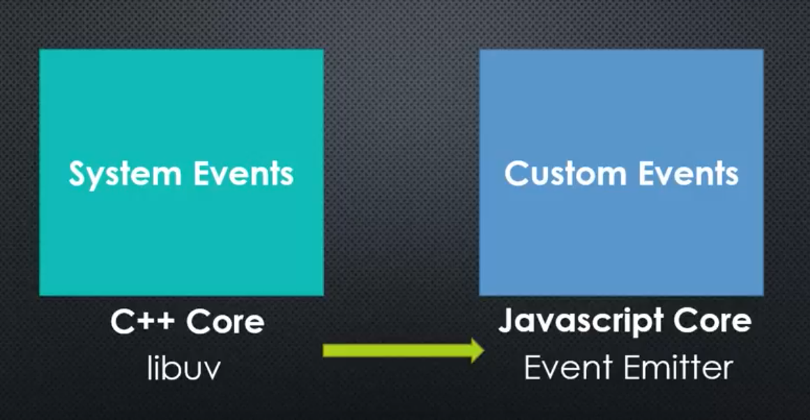
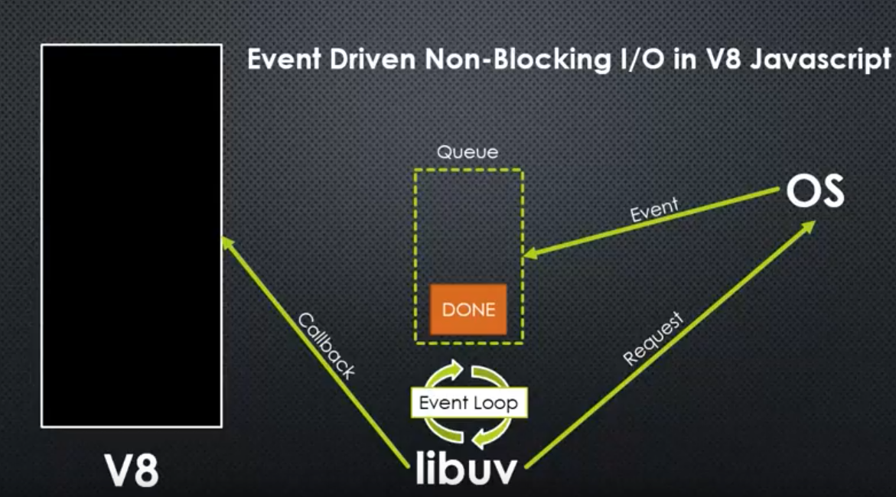

# libuv

* System events are handled by c++ side of core called libuv, it's also embedded inside node. It manages events close to machine.

* Inside node, we have v8 that runs javascript synchronously, meaning that one set of code (or one line of code) is running at a time.

* Also inside node, libuv, which is written specifically to deal with things happenning lower level.

* Libuv requests something from OS, like downloading something from the internet and opening a file.

* Inside libuv, there is a queue of events that have been completed. The most important part of libuv is the event loop. Libuv constantly checks something is happenning.

* Whenever the OS finished some tasks, it put then as events in the queue and libuv checks that in the background.

* Once libuv finds some event is completed, it will ask V8 to run the corresponding callback.

* so, the v8 javascript engine is entirely synchronous while the entire process in nodeJS is asynchronous.
