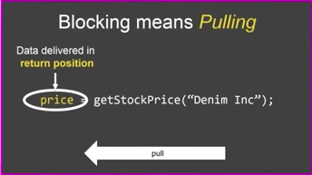
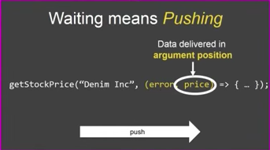

### Blocking is Easy

  ``` javascript
  function getStockPrice(name) {
    var symbol = getStockSymbol(name);
    var price = getSymbolPrice(symbol);
    return price;
  }
  ```

* 
* 

### Use generator

``` javascript
function* getStockPrice(name) {
  var symbol = yield getStockSymbol(name);
  var price = yield getSymbolPrice(symbol);
  return price;
}

function spawn(generator) {
  return new Promise((accept, reject) => {
    var onResult = lastPromiseResult => {
      var (value, done) = generator.next(lastPromiseResult);
      if(!done) {
        value.then(onResult, reject);
      } else {
        accept(value);
      }
    };
    onResult();
  });
}

spawn(getStockPrice("Johnson and Johnson")).then(console.log);
```

* **getStockPrice** is a generator that produce promises, which is an iterator.
* **spawn** takes a generator and consumes promise produced by the generator, which is an observer. It's a convention that spawn will pull a promise out from the generator, resolve it and then push the value back in. So that the **getStockPrice** can be written like blocking but work asynchronously under the hood.
* combine generator with spawn, javascript provides symmetrical support for blocking and waiting.
* ```spawn``` is like ```async``` and ```yield``` is like ```await```.
* In iteration, the consumer is in control, while in observation, the producer is in control. In iteration, the consumer iterates producer, while in observation, the producer iterates consumer.

### Reference
[Jafar Husain: Async Programming in ES7](https://www.youtube.com/watch?v=lil4YCCXRYc)
